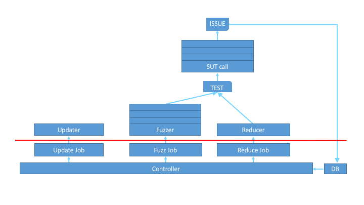

========
Tutorial
========

*Fuzzinator* is a framework helping you to deal with the common fuzzing tasks,
like running fuzz jobs, updating the targets, and reducing the inputs that
induced failures. The figure below shows a high-level overview of the components
of the framework.

The red line represents an API boundary. Everything below it is part of the core
infrastructure, while boxes above it are user-defined. However, you don't
(necessarily) need to write a single line of code to describe your needs, since
*Fuzzinator* can be configured through configuration *ini* files and it comes
with several built-in building blocks that cover the most common scenarios and
can be used out of the box.

In the next paragraphs, we will use the JerryScript_ project as our running
example and we will incrementally build a configuration file to setup a fuzzing
infrastructure for it. We will start from an absolute minimum configuration that
will be extended step-by-step.

.. _JerryScript: https://github.com/Samsung/jerryscript

Although, the examples cover only a small subset of the provided building
blocks, you can find the full list in the API Reference (under sub-packages with
descriptive names). If none of them fits your needs, then you can still write
your own snippet ... or submit a `feature request`_ ;-)

.. _`feature request`: https://github.com/renatahodovan/fuzzinator/issues

Minimum Configuration
=====================

Let's start with the *minimum configuration* example that defines one SUT with
:func:`fuzzinator.call.StdinSubprocessCall`, expecting input from *stdin* and
one test generator with :func:`fuzzinator.fuzzer.RandomContent` that simply
produces random strings.

.. literalinclude:: ../examples/configs/jerry_minimal.ini
   :language: ini
   :lines: 9-

Fine Tuning SUT Calls
=====================

Now, if you would like to *fine-tune error detection* to do more than simply
checking for a non-zero exit-code, then you can use two built-in solutions (or,
again, you can implement your own version):

* :class:`fuzzinator.call.ExitCodeFilter` for keeping issues only if the SUT
  exited with specific exit codes, and
* :class:`fuzzinator.call.RegexFilter` for keeping issues only if the SUT
  printed messages on either *stdout* or *stderr* that matches some specific
  patterns.

We can extend the original example as follows:

.. literalinclude:: ../examples/configs/jerry_issue_filters.ini
   :language: ini
   :lines: 9-

However, issues not only can be filtered but also *extended with arbitrary
information* that helps describing the circumstances of the failure. This
extension can also happen with the above shown decorator approach. The next
example shows how platform, git version, and ID information can be added using:

* :class:`fuzzinator.call.PlatformInfoDecorator` adds an extra ``'platform'``
  field to the issue dictionary, filled with OS information,
* :class:`fuzzinator.call.SubprocessPropertyDecorator` adds a user-defined
  field with the output of a user-defined script, and
* :class:`fuzzinator.call.UniqueIdDecorator` combines existing fields into an ID
  to help detect whether an issue is unique or a duplicate of an already known
  one.

.. literalinclude:: ../examples/configs/jerry_issue_extensions.ini
   :language: ini
   :lines: 9-

Updating SUTs and Reducing Tests
================================

Similarly to the above, we can have control over SUT update and test reduce jobs
as well. The following final example uses built-in building blocks again:

* :class:`fuzzinator.update.TimestampUpdateCondition` for triggering the update
  based on the last modification time of the target binary,
* :class:`fuzzinator.update.SubprocessUpdate` for updating the target via a
  script, and
* :class:`fuzzinator.reduce.Picire` for reducing the size of test cases with
  Picire_.

.. _Picire: https://github.com/renatahodovan/picire

.. literalinclude:: ../examples/configs/jerry_update_and_reduce.ini
   :language: ini
   :lines: 9-

Etc...
======

There is more, e.g.:

* SUTs can take their input from files instead of *stdin*.
* Reducers are highly parametrizable.
* Test reduce jobs can deviate from fuzz jobs in the way their SUT is called.
* Fuzzers can be decorated the same way as SUT calls.
* Etc...

More complex configuration files are available in the ``examples/configs``
directory of the project (e.g., for WebKit_, too).

.. _WebKit: https://webkit.org
